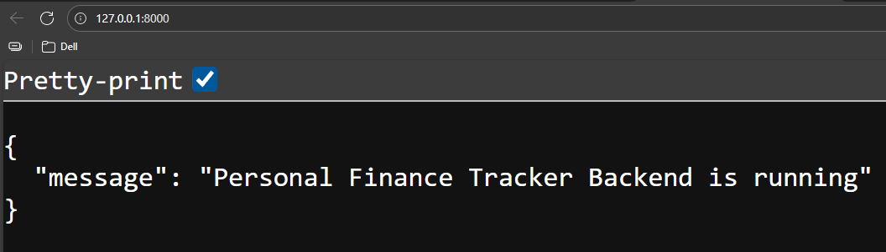
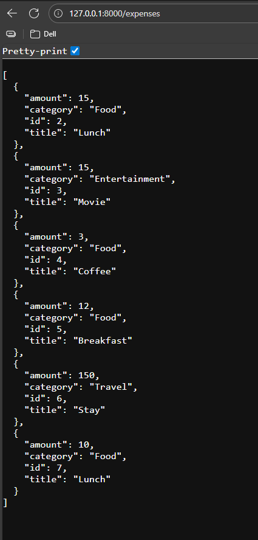
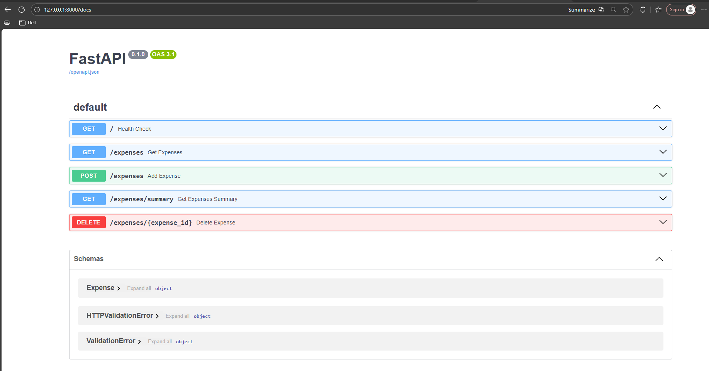
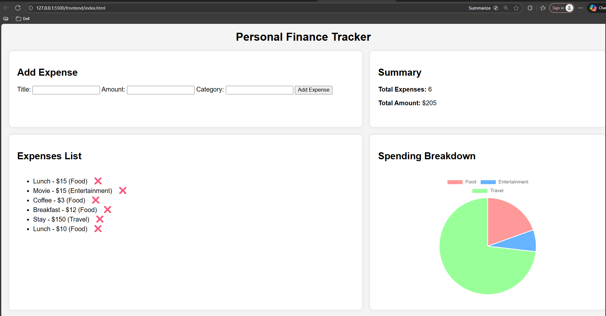

# Personal Finance Tracker – DevOps CI/CD Project

The Personal Finance Tracker is a simple full-stack web application that helps users record daily expenses and visualize their spending.

This project showcases a complete end-to-end CI/CD pipeline designed to build, test, and deploy a fully functional web application along with its cloud infrastructure. We developed a simple full-stack app with a frontend, backend APIs, and a database, then automated the entire workflow using modern DevOps tools such as Git, GitHub, IaC (Terraform), and a CI/CD orchestration tool.

The project demonstrates real-world practices like branching strategy, pull requests, automated testing, code scanning, and cloud deployment. It also includes logging, monitoring, and documentation to ensure reliability and visibility.

## Task 1 — Application Development (Backend, Frontend, Database)

This task focuses on building the core application that will later be deployed through our CI/CD pipeline. We developed a simple Personal Finance Tracker where users can add, view, and delete expenses, while also viewing a real-time summary and spending breakdown. The backend uses FastAPI with SQLite for data storage, and the frontend is built using HTML, CSS, and JavaScript.

### What We Built

We created a working full-stack mini-application that acts as the foundation for our CI/CD pipeline. It includes a clean frontend UI, a FastAPI backend service with multiple REST endpoints, and an SQLite database to persist expense records. The app is small and simple but fully functional, making it ideal for demonstrating automation.

## Architecture Overview

### Backend (FastAPI)

+ The backend is a REST API built using FastAPI

+ Provides endpoints such as:
```
 GET /expenses
 POST /expenses
 DELETE /expense
```
+ Uses Pydantic models for schema validation

+ Modular routing ```(router/expenses.py)```

### Frontend

+ Simple HTML/JS frontend

+ UI connects to FastAPI endpoints through HTTP requests

+ Hosted through AWS later (S3 + CloudFront planned)

### Database Layer

+ Currently in‐memory list for storage

Later planned:

+ PostgreSQL/MySQL on AWS RDS

+ Integration through SQLAlchemy

### Infrastructure
Terraform

Infra folder already created — this is planned to provision:
```
AWS VPC
Public/Private subnets
EC2 FastAPI backend
RDS DB
IAM roles
Security groups
```


### CI/CD Pipeline

Plans:
```
GitHub Actions
Build backend container
Run tests
Deploy to AWS automatically
```
Stages will be:
```
Stage	Description
Source	Git branch → PR workflow
Build	Python dependencies, Docker build
Test	pytest + FastAPI tests
Deploy	Terraform apply → AWS
```
### Monitoring
```
CloudWatch Logs
AWS Metrics
```
📌 How to Run the Application Locally

Follow these steps to run both backend and frontend.

▶️ Step 1: Clone the Repository
```
git clone https://github.com/Deepak-Tamizhalagan/finance-tracker.git
cd finance-tracker
```

▶️ Step 2: Create & Activate Virtual Environment
```
cd backend
python -m venv venv
venv\Scripts\activate   # Windows
```

▶️ Step 3: Install Backend Requirements
```
pip install -r requirements.txt
```

▶️ Step 4: Start the FastAPI Server
```
uvicorn app.main:app --reload
```

If successful, you will see:
```
http://127.0.0.1:8000
```


```
http://127.0.0.1:8000/expenses
```


```
http://127.0.0.1:8000/expenses/summary
```


```
http://127.0.0.1:8000/docs
```


▶️ Step 5: Open the Frontend

Navigate to:
```
finance-tracker/frontend/index.html
```

Right-click → Open with Live Server



📌 5. Expected Behavior

Once both backend & frontend are running:

✔️ Add an expense → Instantly stored in database

✔️ Expense list updates without reload

✔️ Summary updates live

✔️ Chart updates dynamically

✔️ Delete button removes item instantly

## Task-2 – Infrastructure as Code (Terraform)

 Deployed the complete infrastructure for Personal Finance Tracker application using Terraform on AWS. The goal of this task was to automate backend hosting, networking, security, and static frontend deployment by using Infrastructure-as-Code instead of manually configuring AWS services. Terraform helped me create everything in a reproducible way using .tf templates.

 What I built

+ Using Terraform, I provisioned the following AWS resources automatically:

+ VPC

+ Public Subnet

+ Internet Gateway

+ EC2 instance (Ubuntu) to run FastAPI backend

+ Security Group for port 8000 & SSH

+ S3 bucket to host frontend website

+ CloudFront distribution to serve frontend globally

Terraform also prints useful outputs such as:

+ EC2 Public IP

+ S3 bucket name

+ CloudFront domain


### Backend Deployment

After Terraform created the EC2 instance:

+ I SSH-ed into the instance,

+ installed Python and FastAPI,

+ activated virtual environment,

+ and started Uvicorn on port 8000

Finally, I tested the backend using:

```
curl http://localhost:8000
```

and from browser:

http://15.222.63.149:8000


Both returned:
```
{"message": "Personal Finance Tracker Backend is running"}
```


### Frontend Deployment

I updated my API URL inside script.js and uploaded frontend files:
```
aws s3 sync . s3://finance-tracker-frontend-bucket --delete
```

CloudFront automatically picks the website from S3.

Final UI:

https://d1ot1jmefpd9gq.cloudfront.net


Result

✔ Fully automated AWS infra using Terraform

✔ Backend running on EC2

✔ Frontend hosted on CloudFront (via S3)

✔ Backend + frontend integrated successfully
